# Spices

## Cumin Seeds (`jeera`)

## Turmeric Powder (`haldi`)

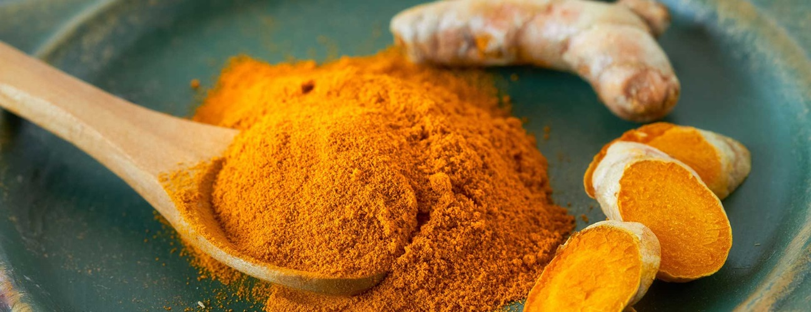

## Red Chilli Powder (`lal mirch`)

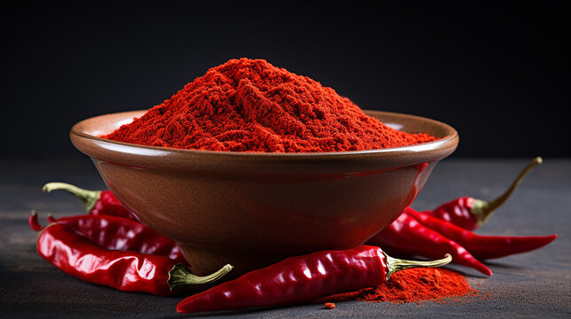

## Coriander Powder (`dhaniya`)

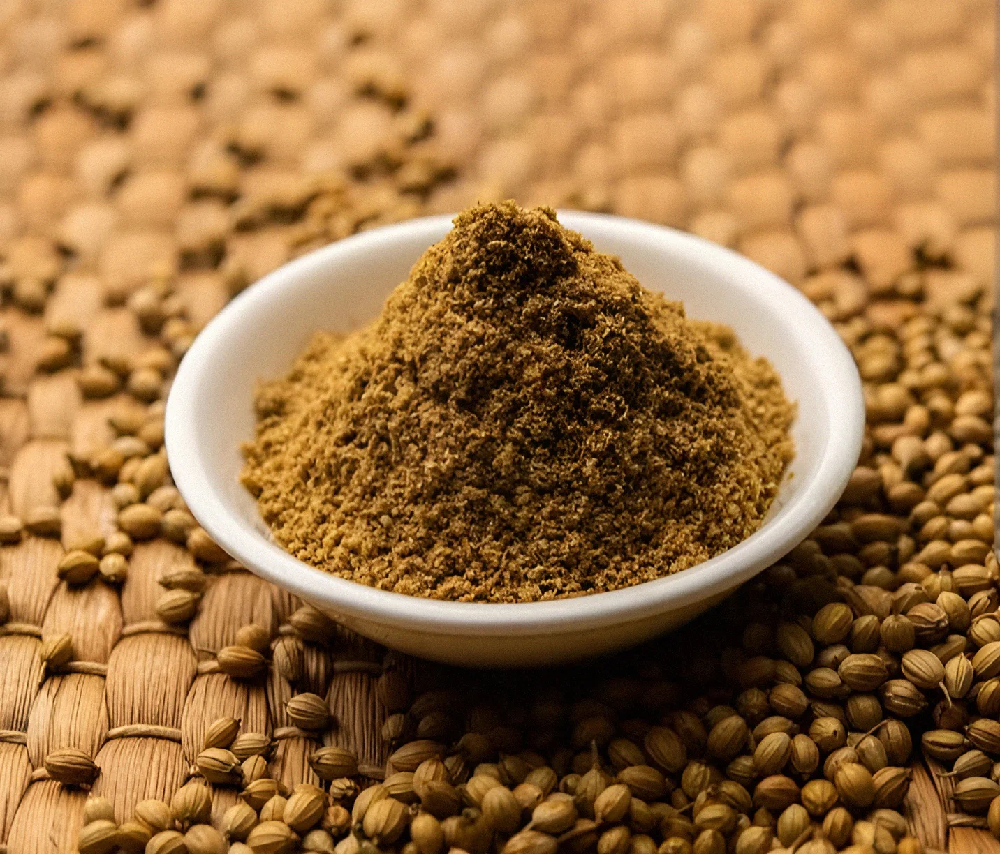

## Black Pepper (`kali mirch`)

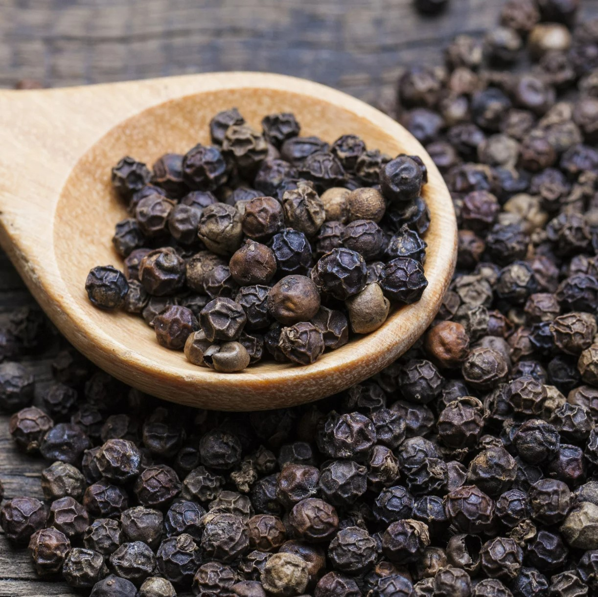

## Mustard Seeds (`sarson`)

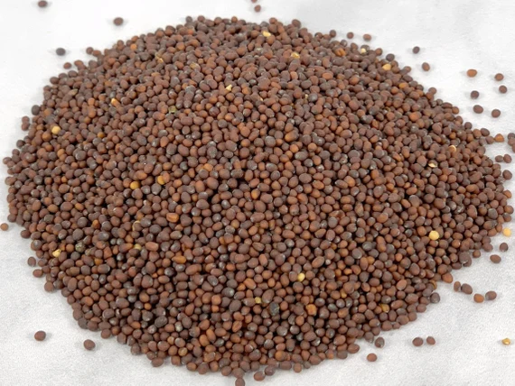

## Fenugreek Seeds (`methi`)

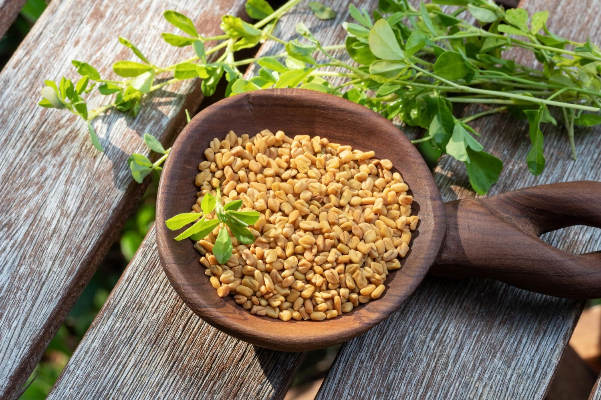

## Asafoetida (`hing`)

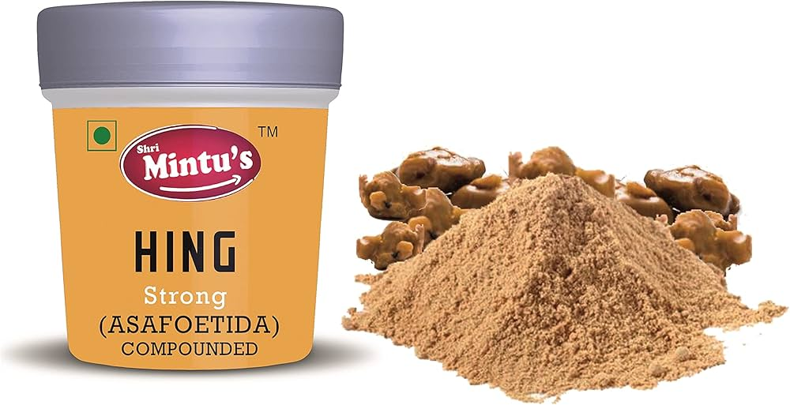

## Bay Leaf (`tej patta`)

## Cinnamon (`dalchini`)

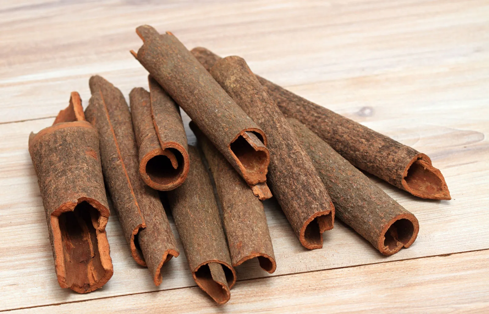

## Cloves (`laung`)

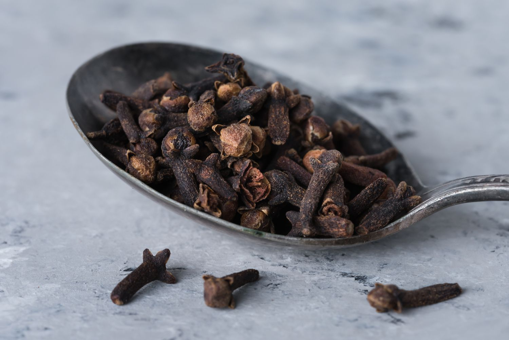

## Cardamom (`elaichi`)

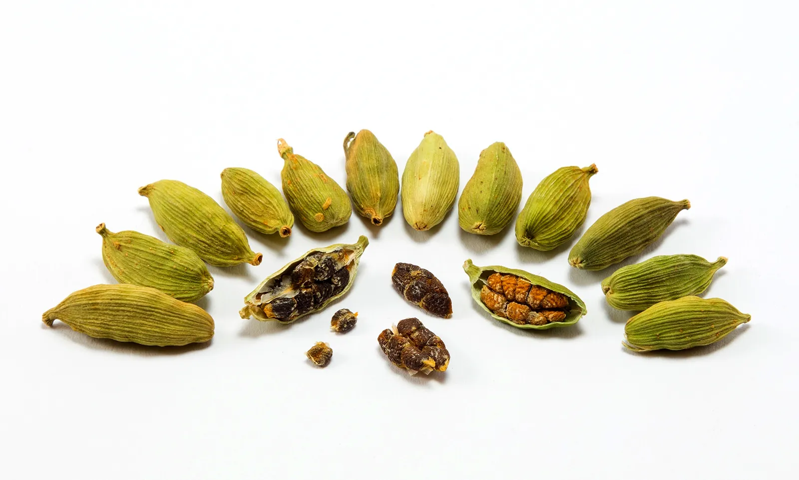

## Fennel Seeds (`saunf`)

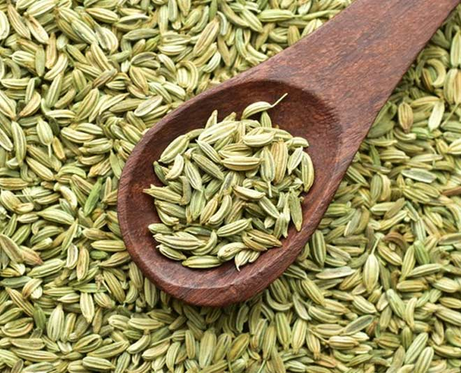
