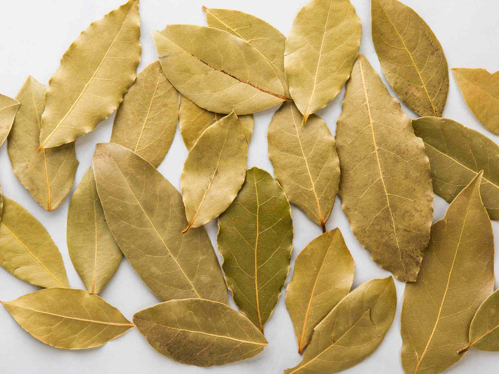

# Spices

## Cumin Seeds (`jeera`)

## Turmeric Powder (`haldi`)

## Red Chilli Powder (`lal mirch`)

## Coriander Powder (`dhaniya`)

## Black Pepper (`kali mirch`)

## Mustard Seeds (`sarson`)

## Fenugreek Seeds (`methi`)

## Asafoetida (`hing`)

## Bay Leaf (`tej patta`)

## Cinnamon (`dalchini`)

## Cloves (`laung`)

## Cardamom (`elaichi`)

## Fennel Seeds (`saunf`)

